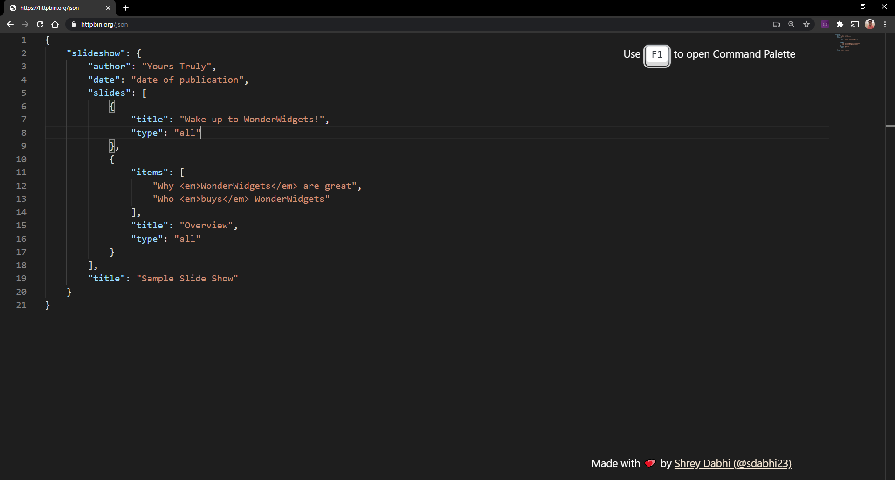

#  Monaco JSON Viewer

A minimalistic JSON viewer built using open-source components!

## Components used

* [Monaco Editor](https://github.com/microsoft/monaco-editor): The code editor that powers VS Code
* [Keyboard CSS](https://github.com/shhdharmen/keyboard-css): A library of ready-to-use, cross-browser compatible keyboard like button UI

## License

Monaco JSON Viewer is licensed under the [MIT](LICENSE) license
