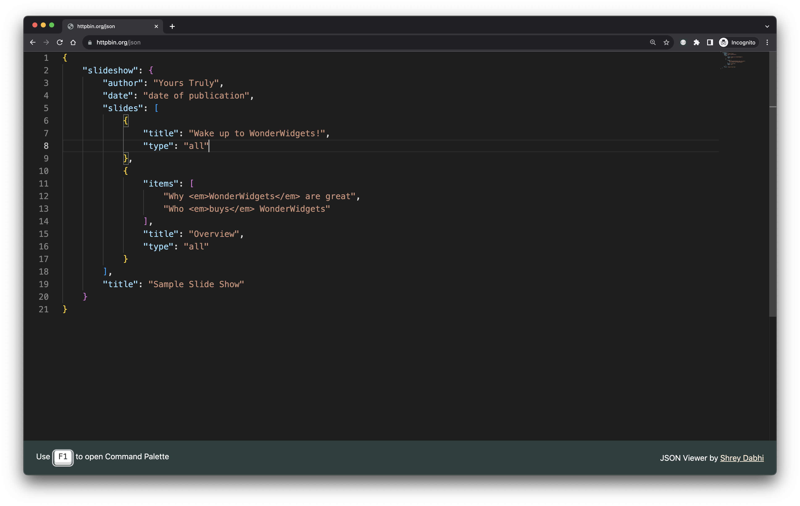

#  Monaco JSON Viewer

A minimalistic JSON viewer built using open-source components!

## Installation instructions

Currently anyone can sideload this extension on Google Chrome or Microsoft Edge by downloading the zip file of the [latest release](https://github.com/sdabhi23/monaco-json-viewer/releases)

### Google Chrome

Adapted from [How to install Chrome extensions manually from GitHub | dev.to](https://dev.to/ben/how-to-install-chrome-extensions-manually-from-github-1612)

1. Download and unzip the zip file of the [latest release](https://github.com/sdabhi23/monaco-json-viewer/releases)

2. Visit <chrome://extensions> and turn on "Developer mode"

    

3. Click "Load unpacked" button and navivigate to the folder you downloaded from GitHub

    

**Update the extension:** Navigate to <chrome://extensions>, and then select Reload to update your extension.

**Remove the extension from your browser:** Navigate to <chrome://extensions>, and then select Remove on your extension.

That's it 🎉

### Microsoft Edge

Adapted from [Sideload an extension | Microsoft Edge documentation](https://docs.microsoft.com/en-us/microsoft-edge/extensions-chromium/getting-started/extension-sideloading)

1. Download and unzip the zip file of the [latest release](https://github.com/sdabhi23/monaco-json-viewer/releases)

2. Open the <edge://extensions> page by choosing the three dots at the top of your browser, and then selecting Extensions

    

3. On the extension management page at <edge://extensions>, turn on **Developer mode** using the toggle at the bottom left of the page.

    

4. When installing your extension for the first time, choose **Load Unpacked**. You'll be prompted for the directory with your extension source files. Your extension is installed in your browser, similar to extensions installed from the store.

    

**Update the extension:** Navigate to <edge://extensions>, and then select Reload to update your extension.

**Remove the extension from your browser:** Navigate to <edge://extensions>, and then select Remove on your extension.

That's it 🎉

## Components used

* [Monaco Editor](https://github.com/microsoft/monaco-editor): The code editor that powers VS Code
* [Keyboard CSS](https://github.com/shhdharmen/keyboard-css): A library of ready-to-use, cross-browser compatible keyboard like button UI

## License

Monaco JSON Viewer is licensed under the [MIT](LICENSE) license
